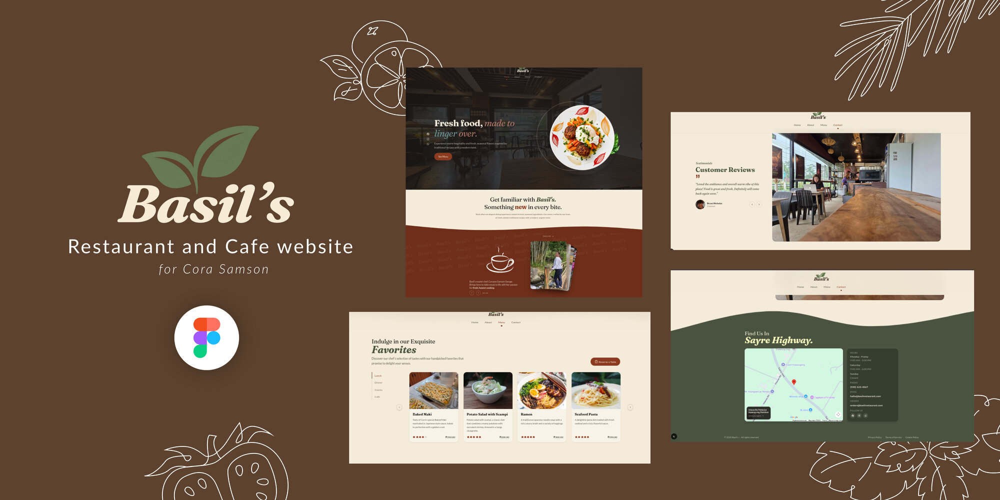

# 🌿 Basil's

A restaurant website built for my mother, with love. Basil's is a farm-to-table restaurant site
featuring an interactive story deck, a categorized menu with a live reservation form, rotating
customer testimonials, and a contacts section with an embedded map.

**Live site: [basils-bukidnon.vercel.app](https://basils-bukidnon.vercel.app/)**

<p align="center">
  
</p>

Basil's is currently a **static frontend**, there's no database or backend service behind it yet.
The Reserve a Table form simulates a submission client-side; nothing is persisted or sent anywhere
today.

## Features

- Interactive About section with a draggable story card deck
- Categorized Menu with real dish photos and a Reserve a Table dialog
- Rotating Testimonials carousel with customer photos
- Contacts section with hours, socials, and an embedded Google Map
- Scroll-triggered entrance animations throughout, built with Motion (Framer Motion)
- Fully responsive, from mobile up through ultrawide/4K displays

## Tech Stack

- [Next.js 16](https://nextjs.org) (App Router, Turbopack)
- [React 19](https://react.dev)
- [Tailwind CSS v4](https://tailwindcss.com)
- [shadcn/ui](https://ui.shadcn.com) + [Radix UI](https://www.radix-ui.com)
- [Motion](https://motion.dev) (Framer Motion) for animation
- [react-icons](https://react-icons.github.io/react-icons/)
- TypeScript
- Built with [Claude Code](https://claude.com/claude-code) as an AI pair-programmer

## Planned / Future Work

These are documented here as the roadmap, not yet implemented:

- **Review pipeline**: a QR code placed on tables that links to a Google Form (Likert-scale +
  per-dish rating), with responses feeding into the star ratings shown on the Menu.
- **Reservation form backend**: a real endpoint behind the Reserve a Table form, with rate
  limiting and basic abuse protection once it exists.
- **Legal pages**: real Privacy Policy, Terms of Service, and Cookie Policy pages — the footer
  links for these exist today but aren't wired up yet.
- Wiring up the already-present-but-unused `@supabase/supabase-js` dependency for actual data
  storage.

## Getting Started

```bash
npm install
npm run dev
```

Open [http://localhost:3000](http://localhost:3000) to view it.

## Scripts

- `npm run dev` — start the local dev server
- `npm run build` — production build
- `npm run start` — run the production build locally
- `npm run lint` — lint the codebase

## Deployment

This project is deployed on [Vercel](https://vercel.com) at
[basils-bukidnon.vercel.app](https://basils-bukidnon.vercel.app/). Pushing to `main` automatically
builds and deploys the latest changes.
